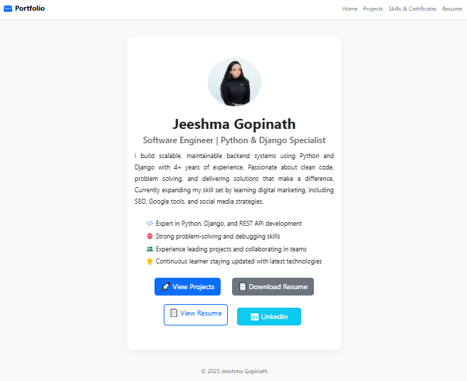

# Jeeshma Gopinath – Developer Portfolio


This is my personal portfolio website built using **Django** and **Django REST Framework**. It showcases my skills, projects, resume, and certifications. I'm passionate about clean code, backend development, and currently expanding into digital marketing.

---
## 🚀 Live Demo
**(Add link here after deployment)**

## 🔧 Tech Stack

- **Backend**: Python, Django, Django REST Framework (DRF)
- **Frontend**: HTML, CSS (Bootstrap), JavaScript (minimal)
- **Database**: SQLite (for development)
- **Other Tools**: Git, GitHub, Bootstrap, Render (for deployment)

## 📁 Features

- Professional profile page with downloadable resume
- Dynamic project listing from the database
- Skills and certifications page (including digital marketing)
- Clean responsive UI built with Bootstrap
- Admin panel to update profile and content

## 📸 Screenshots




## 🔨 Setup Instructions

```bash
# Clone the repo
git clone https://github.com/Jeeshma2009/portfolio-website.git
cd skillportfolio

# Create and activate virtual environment
python -m venv venv
source venv/bin/activate  # On Windows: venv\Scripts\activate

# Install dependencies
pip install -r requirements.txt

# Run migrations and create superuser
python manage.py migrate
python manage.py createsuperuser

# Run server
python manage.py runserver
